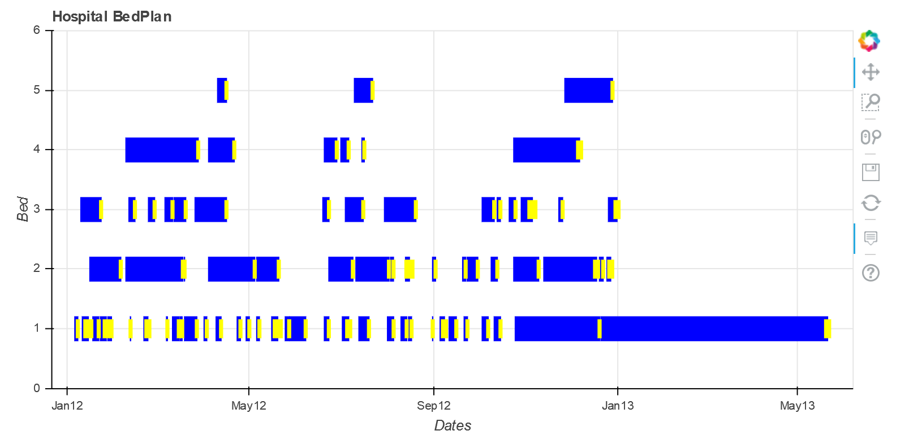
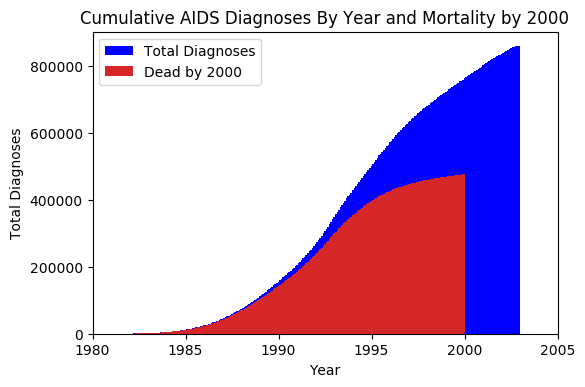

# InsightProject

This is the source code for http://insightfullyyours.pythonanywhere.com/beplanstart, which is hosting my Insight Project, written for the Boston Health Data Science 2017b session, as well as my older 'The AIDS Crisis in the US' project (discussed in the AIDS-Web-App repository).  The Insight Project begins at http://insightfullyyours.pythonanywhere.com/bedplanpresentation and the AIDS Project begins at http://insightfullyyours.pythonanywhere.com/Crisis. 

My Insight Project focused on using machine learning to predict patients' durations of stay in a Hospital based upon inpatient and outpatient data, and then optimally schedule ward beds.  This provides administrators with an understanding of which patients will be staying longer as well as when they may need to consider bringing in additional beds.

Please see the AIDS Database Analysis and AIDS-Web-App repositories for details on those projects.  This is the updated version of the website code, making the 'AIDS-web-app' code obsolete through its combination with the Insight Project code.

Please enjoy.

 

 

 

 
